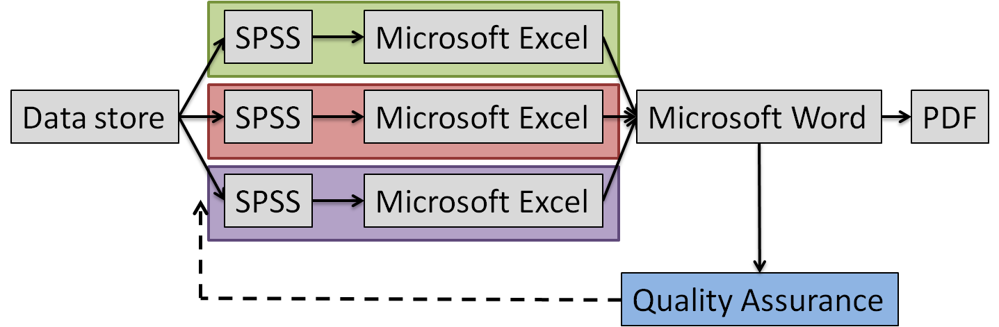
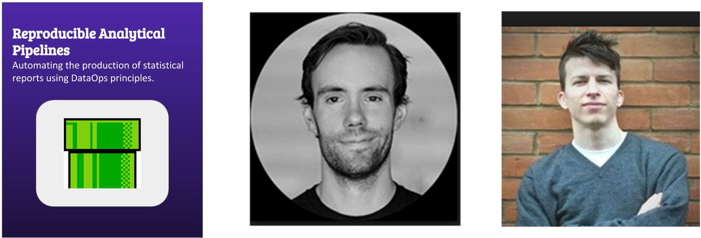
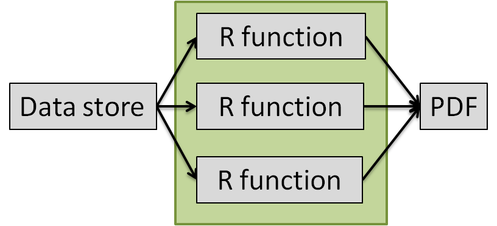
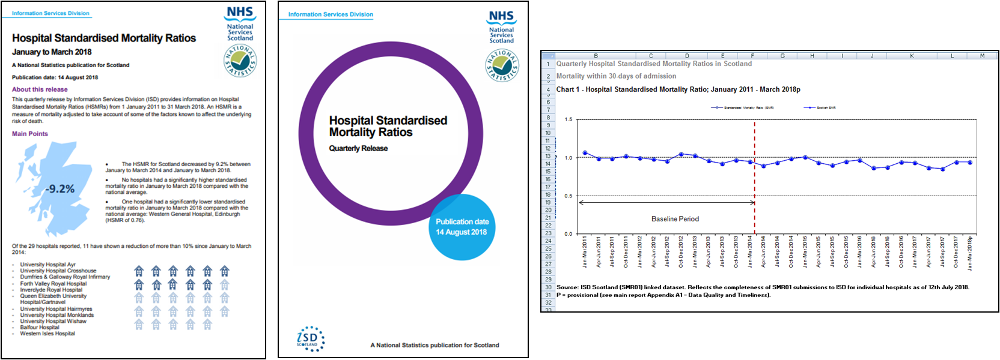

```{r setup, include = FALSE}
library(knitr)
library(magrittr)
library(kableExtra)

knitr::opts_chunk$set(echo = FALSE)

# Create data frame for levels of automation table
automation_levels <- data.frame(c(1:3, c("4a", "4b"), 5:7),
                                c("Ad hoc R code",
                                  "R project",
                                  "R project under version control (VC)",
                                  "R project under VC and peer reviewed (wrangling)",
                                  "Replicable report in Rmarkdown (publication)",
                                  "Near RAP (VC, peer review, data quality assurance)",
                                  "Full RAP (as above plus unit testing and documentation)",
                                  "R package"))

```

## Reproducible research

- Not a new concept
- Encouraged and growing within academia for last 10-15 years
- Provides evidence of the correctness of results
- Exposes workflow to others
- Enables others to make use of methods and results

Insert image of Trustworthiness pillar from UKSA code of practice to link with transparency principle - Carolyn

## Current publication process

```{r out.width = "80%", fig.align='center'}

```

- Complex (many steps between software)
- Prone to error
- Manual, menial tasks carried out by highly skilled people
- Not reproducible or sustainable

Insert image of Quality pillar from UKSA code of practice to link with second bullet point - Carolyn

## The solution

```{r out.width = "60%", , fig.align = 'center'}

```

[RAP companion](https://ukgovdatascience.github.io/rap_companion/)

Combined the priniciples of **reproducible research** with **data science tools and best practice**.

```{r out.width = "55%", fig.align = 'center'}

```

## Why R?

```{r out.width = "80%", fig.align = 'center'}
include_graphics("images/r_vs_python.jpg")
```

## What is RAP?

Insert jigsaw puzzle image - Carolyn

## Transforming Publishing test case: Hospital Standardised Mortality <br> Ratio publication

```{r out.width = "100%", fig.align = 'center'}

```

## Levels of automation

```{r, echo = FALSE}
    kable(automation_levels,
          col.names = c("Level", "Description"),
          format = "markdown")
```

## Challenges
- Culture change (peer review and working in the open)
- New software such as R and git
- Required development time
- Range of data sources and/or unstable production process
- IT (R server and internally hosted code repository)

## Interested in RAP?...

- How many reports do your team produce?
- What proportion of time is spent producing reports?
- How much copying and pasting/data movement between software is involved?
- What proportion of your spreadsheet or report contains errors?
- What would the impact of mistakes in production be?
- Could your team create the report if certain team members suddenly left?
- Could you reproduce your publication statistics from 5 years ago?

Contact the Transforming Publishing team (nss.isdtransformingpublishing@nhs.net)

## Thank You {.smaller}
<div class="columns-1">
<ul>
```{r out.width = "15%"}

```
<br>
```{r out.width = "5%"}
include_graphics("images/twitter.png")
```
@price_AH
<br>
```{r out.width = "5%", }
include_graphics("images/github.png")
```
annahprice
</ul>
</div>

```{r out.width = "60%", fig.align = 'center'}

```

Need to udpate team image

Contact Transforming Publishing: nss.isdtransformingpublishing@nhs.net

Transforming Publishing on GitHub: <br> https://github.com/NHS-NSS-transforming-publications

ISD on GitHub: https://github.com/Health-SocialCare-Scotland

RAP companion: https://bit.ly/2PhLYbL


